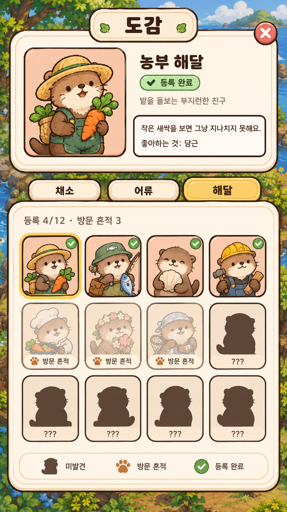
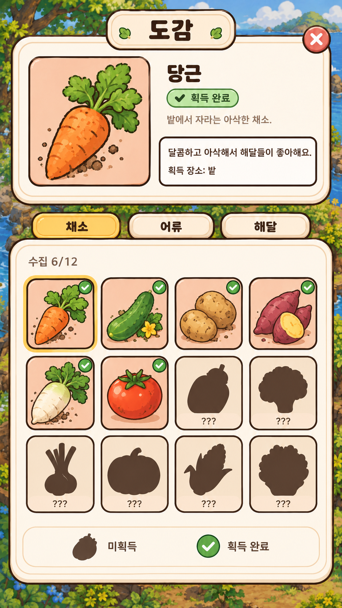
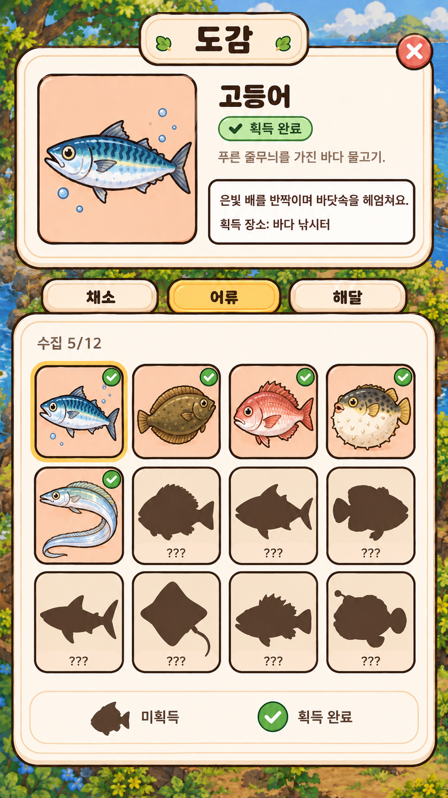
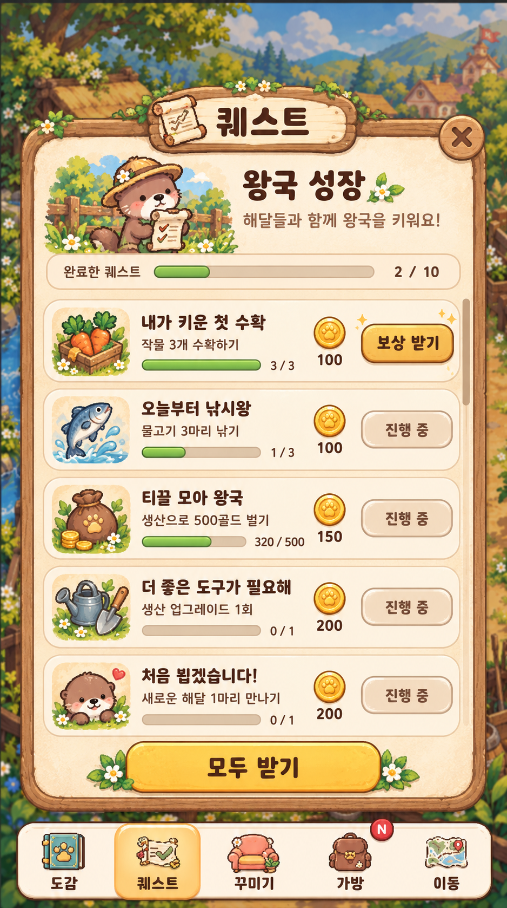

# 도감 · 퀘스트 UI 레퍼런스와 오프라인 작업 연동 사항 (클로드 전달용)

- 작성자: sanghyeonLee (`GameManager`, `Farm/`, `Fishing/`, `Plaza/`, `Save/` 담당)
- 대상: choiwoohyck (`Inventory/`, `Currency/`, `Navigation/`, 공용 UI 담당)과 그쪽 Claude
- 작성일: 2026-09-29
- 작업 브랜치: `feature/OfflineAutoPlay` (`develop`의 `b983bc5` 기준)
- 함께 읽을 문서: `Docs/오프라인자동수확_작업기록.md`, `Docs/네비게이션_연동요청_클로드전달용.md`

---

## 0. 요약

두 가지를 전달한다.

1. **도감 · 퀘스트 UI 레퍼런스 (1~3장).** 이미지와 UI를 그쪽에서 만들고 있으니 그림체를 맞추려고 레퍼런스 시안을 만들었다. 기존 UI(크림색 패널, 갈색 테두리, 살구색 슬롯)를 그대로 따랐다. 새로 만드는 도감 · 퀘스트 화면은 이 시안을 참고하면 된다.
2. **오프라인 작업에서 그쪽과 겹치는 부분 (4~5장).** 지난 네비게이션 요청에 대한 회신, 이쪽에서 바꾼 공용 부분, 부탁과 질문이다.

---

## 1. 도감

### 1.1 구성

- 상단: 선택한 항목의 일러스트, 이름, 상태 배지, 한 줄 소개, 설명 박스
- 중간: **채소 / 어류 / 해달** 탭
- 하단: 4열 목록, 수집 현황(예: `수집 6/12`), 맨 아래에 상태 범례
- 선택한 칸은 **금색 테두리**로 표시한다

시장놀이 3의 물품 목록 화면처럼 한눈에 모은 것과 못 모은 것이 보이게 하는 게 목표다.

### 1.2 상태

| 탭 | 상태 | 표시 | 조건 |
|---|---|---|---|
| 채소 · 어류 | 미획득 | 실루엣 + `???` | 아직 한 번도 얻지 못함 |
| 채소 · 어류 | 획득 완료 | 원래 색상 + 초록 체크 | 처음 수확하거나 낚으면 자동 등록 |
| 해달 | 미발견 | 실루엣 + `???` | 섬에 온 적이 없음 |
| 해달 | 방문 흔적 | 반투명 + 발자국 + "방문 흔적" | 플레이어가 **오프라인**인 동안 섬에 왔다 감 |
| 해달 | 등록 완료 | 원래 색상 + 초록 체크 | **온라인** 중에 섬에 온 해달을 플레이어가 눌러서 등록했거나, 가챠에서 나옴 |

- 해달 탭의 수집 현황은 `등록 4/12 · 방문 흔적 3`처럼 두 숫자를 같이 보여준다.
- 상단 배지는 채소 · 어류가 "획득 완료", 해달이 "등록 완료"다.
- 채소 · 어류의 설명 박스에는 **획득 장소**(예: 밭, 바다 낚시터)를 넣는다. 해달은 **좋아하는 것**을 넣는다.

### 1.3 레퍼런스

시안에 나온 작물, 어종, 해달 캐릭터, 설명 문구, 수집 수치는 **배치 확인용 예시**다. 실제 목록이 아니다.

| 해달 탭 | 채소 탭 | 어류 탭 |
|---|---|---|
|  |  |  |

---

## 2. 퀘스트

### 2.1 구성

- 상단 제목 "퀘스트", 오른쪽 위 닫기(X)
- 헤더: 해달 일러스트, "왕국 성장", 부제 "해달들과 함께 왕국을 키워요!"
- 전체 진행: `완료한 퀘스트 2 / 10` + 진행 바
- 퀘스트 한 줄: 아이콘, 제목, 설명, 진행 바와 `현재 / 목표`, 보상 코인 아이콘과 금액, 오른쪽 버튼
- 버튼 상태: 완료했으면 금색 **[보상 받기]**, 진행 중이면 회색 **[진행 중]**
- 목록은 세로로 스크롤한다
- 맨 아래 **[모두 받기]**: 받을 수 있는 보상을 한 번에 받는다
- 네비게이션 바의 퀘스트 버튼이 선택된 상태로 표시된다

### 2.2 레퍼런스

퀘스트 제목, 조건, 보상 금액은 **시안용 예시**다. 실제 퀘스트 목록과 보상은 따로 정한다.

---

## 3. 그림체 통일

- 패널: 크림색 바탕 + 갈색 나무 테두리, 제목은 나무 간판 모양
- 슬롯과 일러스트 배경: 살구색
- 강조: 금색(선택 테두리, 보상 받기, 모두 받기, 선택된 탭)
- 완료 표시: 초록 원 안의 흰 체크
- 실루엣: 짙은 갈색 단색
- 가방 화면과 네비게이션 바의 기존 스타일을 기준으로 삼았다

---

## 4. 네비게이션 요청 회신

`Docs/네비게이션_연동요청_클로드전달용.md` 2장에 대한 회신이다.

| # | 부탁 | 결과 |
|---|---|---|
| (1) | 광장 씬 매니저 확인 | 확인했다. 광장에 `GameManager`도 추가했다 (아래 5.1) |
| (2) | 이동 전에 저장 | **반영했다.** `GameManager`가 `SceneNavigator.BeforeLeave`에 `SaveNow`를 연결한다 |
| (3) | 다른 장소에 있는 동안의 생산 | 밭 시간은 **모든 장소에서** 흐른다. 수확은 밭 씬의 해달이 해야 해서, 다른 장소에 있는 동안 다 자란 작물은 수확 대기에서 멈춘다. 이대로 가기로 했다 |
| (4) | 화면 아래쪽 겹침 확인 | 아직 확인하지 않았다. 아래 5.3의 판매 버튼이 겹칠 수 있다 |
| (5) | EventSystem과 캔버스 순서 | EventSystem은 추가하지 않는다 (`GameUI`는 이미 있으면 만들지 않음). 캔버스 순서는 5.3 참고 |

---

## 5. 오프라인 작업에서 그쪽과 겹치는 부분

### 5.1 씬 변경 — 충돌 주의

`OtterKingdom > Tools > Setup GameManager Prefab`으로 `Assets/Prefabs/GameManager.prefab`을 만들고 세 장소 씬에 배치했다.

- `Farm.unity`, `Fishing.unity`: 기존 `GameManager` 오브젝트를 프리팹 인스턴스로 바꿨다
- `Plaza.unity`: `GameManager` 프리팹 인스턴스를 추가했다 (판매 버튼 꺼짐)
- `Farm.unity`: 오프라인 농사 NPC(`OfflineFarmNpc`)를 추가했다

세 씬 모두 그쪽에서도 `GlobalUI`를 배치한 씬이다. 같은 씬을 동시에 고치고 있다면 머지할 때 충돌이 날 수 있으니 알려 달라.

### 5.2 가방에 들어오는 것 (오프라인 수확)

앱을 켜거나 앱으로 돌아올 때, 오프라인 동안 모은 것을 한 번에 가방에 넣는다.

- 채소: `Bag.Add(..., ItemChangeReason.Harvest)`, 물고기와 쓰레기: `ItemChangeReason.Fishing`
- 소모형 모종: 수확 1번에 `Bag.TryRemove(seed, 1, ItemChangeReason.Plant)`
- **가방이 가득 차서 못 넣은 것은 버린다.** 복귀 팝업에 "가방이 가득 차서 놓친 것"으로 따로 보여준다. 지난 인벤토리 회신 1장에서 정한 규칙("오프라인 중 모으기는 가방이 차면 나머지를 버린다")대로다
- 한 번에 많이 들어올 수 있다. 예를 들어 1시간이면 채소 한 칸에 33개, 물고기와 쓰레기 36개다. `MaxStack`에 걸린 양도 버려진다

`Inventory/`, `Currency/` 코드는 바꾸지 않았다.

### 5.3 `GameUI` 캔버스 순서 — 이쪽에서 고칠 문제

이쪽의 임시 UI(`GameUI`, 코드로 만드는 uGUI) 캔버스 `sortingOrder`가 **200**이다. 요청 문서의 "100보다 작게"를 지키지 못하고 있다.

- 팝업이 네비게이션 바 위에 뜨는 것은 괜찮다고 본다.
- 밭 · 낚시터 오른쪽 아래의 임시 "판매" 버튼이 네비게이션 바 위에 겹쳐 그려질 수 있다.
- 판매 버튼과 낚싯대 강화 버튼은 임시 디버그용이다. 5.4의 판매 기능이 생기면 없앨 예정이다.

### 5.4 부탁

**가방 상세 화면에 판매 버튼.** 지금 가방 상세 화면은 판매가만 보여주고 판매할 방법이 없다. 이쪽 임시 판매 버튼을 없애려면 가방에서 팔 수 있어야 한다. `InventoryManager.TrySell`은 이미 있다.

- 이쪽은 누적 판매액(`SaveData.lifetimeSales`)을 판매 금액만큼 따로 더해야 한다. 가방에서 판매가 일어났다는 걸 알 수 있는 이벤트나 콜백이 있으면 좋겠다.

### 5.5 질문

**`seed_carrot`, 오이 모종 아이템의 용도.** `fa23fae`에서 당근 모종과 오이 모종 아이템이 추가됐다. 이쪽 설계에서 당근과 오이는 **영구 모종**이라 개수가 없고 가방 아이템도 쓰지 않는다 (인벤토리 회신 2장). 지금 게임 코드는 이 두 아이템을 쓰지 않아서 당장 문제는 없다. 요정 상점에서 팔 계획이라면 설계가 서로 어긋나니 의도를 알려 달라.

### 5.6 참고

- **밭 레벨과 낚싯대 레벨로 오프라인 기능이 열린다** (둘 다 2 이상). 밭 레벨을 올리는 UI는 아직 없다. 마을 업그레이드, 광장 NPC, 상점 확장 중 하나로 정할 예정이다. 상점으로 정해지면 그쪽과 다시 이야기하겠다.
- **코인 HUD 중복 수정:** 이쪽 임시 코인 HUD(`CurrencyHud`)가 장소를 옮길 때마다 하나씩 쌓이던 문제를 고쳤다.
- **감자 판매가**는 `ItemDefinition` 값(15)을 따르는 것으로 확인했다. `CropDefinition` 판매가 필드 정리와 판매 필터를 `item.IsSellable`로 바꾸는 일은 아직 하지 않았다.

---

## 6. 브랜치

`feature/OfflineAutoPlay`는 `develop`의 `b983bc5`(Navigation 머지) 위에서 작업했다. 확인이 끝나면 `develop`으로 PR을 올린다. 이미 머지된 커밋은 rebase나 force-push를 하지 않는다.
